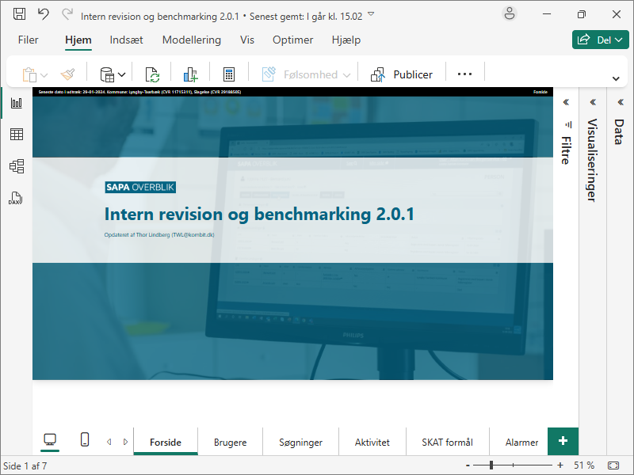
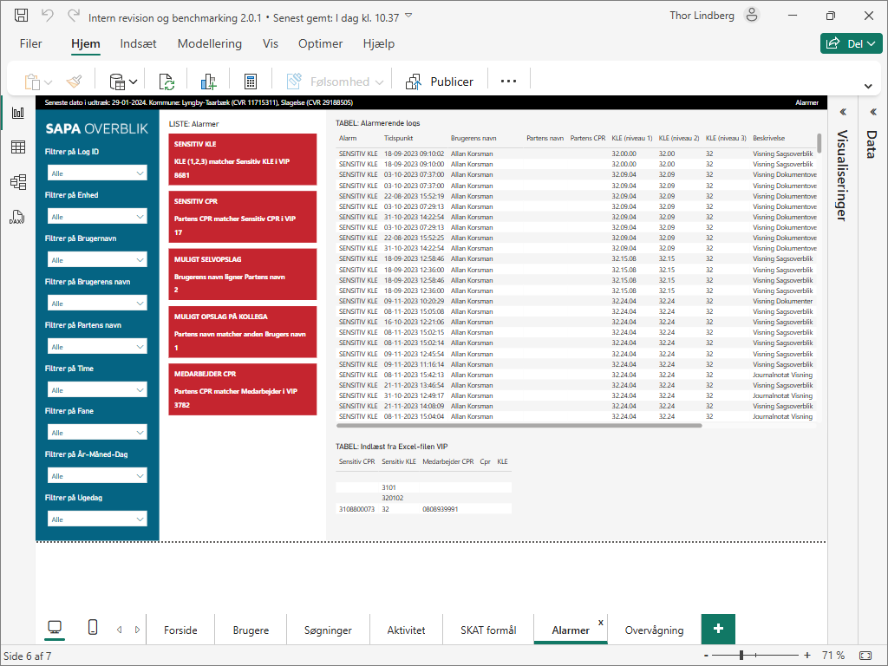
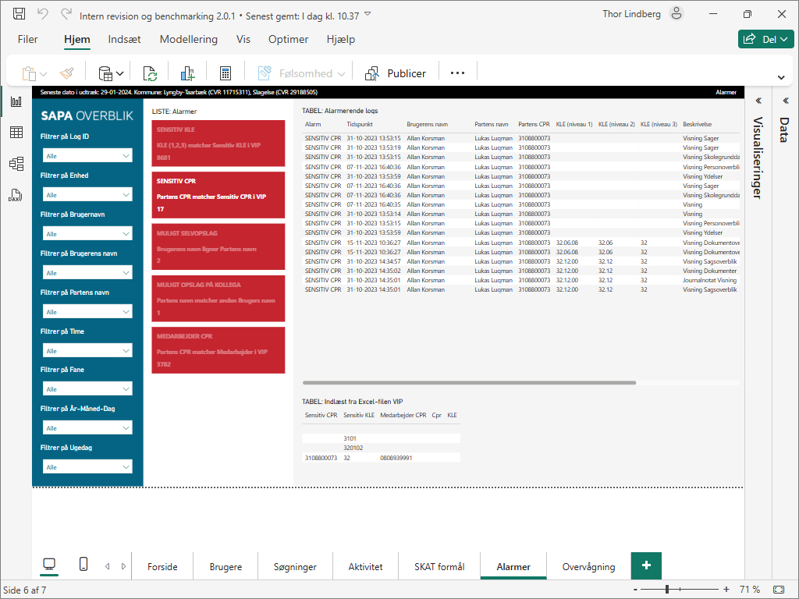

---
lang: da-DK
title: "Vejledning til Revisionsrapport (Power BI)"
author: "Sags- og Partsoverblikket (SAPA)`<w:p><w:r><w:br w:type='page'/></w:r></w:p>`{=openxml}"
toc-title: "Indholdsfortegnelse"
...

# Introduktion

I denne vejledning beskrives hvordan du kommer igang med Power BI og SAPAs rapport til Revisionsloggen.

Formålet med denne rapport er at give jer et interaktivt værktøj til at undersøge jeres data.

Rapporten baseres på din kommunes revisionslog fra SAPA. Rapporten indeholder en brugsstatistik, logs på søgninger og aktivitet, brug af SKAT-formål, samt alarmer og overvågning for potentielt uønsket aktivitet.



```{=openxml}
<w:br w:type="page"/>
```

# Hent Revisionlogsudtræk i SAPA

Revisionsloggen kan hentes i SAPA Overblik Administration, på siden "Revisionslog", ved at trykke på knappen "Hent". Det kan tage omkring 30 minutter at danne et udtræk.

Yderligere information om Revisionslog-siden i SAPA Overblik Administration kan findes i dokumentet ”Administratorvejledning for SAPA” under ”1.4.3.1 Revisionslog”. 


```{=openxml}
<w:br w:type="page"/>
```

## Valgfrit: Afgrænsning af udtræk

Hvis det ønskes er det muligt at filtrere Revisionsloggen inden den hentes, f.eks. filtreret på afdeling(er) i kommunen. Dette er ikke nødvendigt hvis du gerne vil have et udtræk som dækker alt aktivitet for alle brugere og organisationer i kommunen.

I dette eksempel hentes Revisionsloggen afgrænset på en Organisatorisk enhed, ved at fremsøge enheden på Revisionslog siden, og herefter trykke på knappen "Hent".


```{=openxml}
<w:br w:type="page"/>
```

# Installation af Power BI og rapport

I dette afsnit beskrives hvordan du kommer igang med at ibrugtage Power BI og SAPAs rapport til indsigt i Revisionsloggen.

## Installation af Power BI

_Hvis du allerede har Power BI på din computer kan du blot springe dette trin over._

1. Gå til Microsofts Power BI hjememside ([https://powerbi.microsoft.com/da-dk/downloads](https://powerbi.microsoft.com/da-dk/downloads)).
2. Klik ”Download” under ”Microsoft Power BI Desktop”.
3. Følg installationen.


```{=openxml}
<w:br w:type="page"/>
```

## Hent SAPAs rapport

Du finder Power BI filen i din kommunemappe, i en ”SAPA Power BI” mappe sammen med denne vejledning, filen hedder ”Intern revision og benchmarking” og er en pbix-fil.

1. Gå til jeres Kommune Dashboard ([https://kombitdk.sharepoint.com/:f:/r/sites/SAPA-rapportering/Shared%20Documents/Kommune%20dashboards](https://kombitdk.sharepoint.com/:f:/r/sites/SAPA-rapportering/Shared%20Documents/Kommune%20dashboards)).
2. Du skal downloade rapporten så du har en version lokalt på din computer, det er underordnet, hvor du gemmer rapporten. 
3. Her downloader du også Excel-filerne ”VIP" og "Overvågning".


```{=openxml}
<w:br w:type="page"/>
```

# Se anvendte dataadgange

I dette afsnit beskrives hvordan du kan se dine brugers anvendte dataadgange på baggrund af den Revisionslog du har hentet fra SAPA Administration.

KOMBIT har lavet to typer værktøj til at se dataadgange:

- __Power BI rapport__
- __Excel skabelon__

I denne tabel kan du se alle de værktøjer som er tilgængelige. Det letteste værktøj vil være en Excel skabelon, som bare skal være åben i Excel på samme tidspunkt som din Revisionslog fil.

| Type | Filnavn |
| :- | :------------ |
| __Power BI__ | Indkomstoplysninger, mellem og snæver dataadgange.pbix |
| __Excel__ | Skabelon til mellem og snæver dataadgange (automatisk indlæsning, 2 timer tilbage).xlsx |
| __Excel__ | Skabelon til mellem og snæver dataadgange (automatisk indlæsning, 1 time tilbage).xlsx |
| __Excel__ | Skabelon til mellem og snæver dataadgange (automatisk indlæsning, 30 minutter tilbage).xlsx |
| __Excel__ | Skabelon til mellem og snæver dataadgange (manuel indlæsning).xlsx |

Bemærk at Excel skabeloner med "automatisk indlæsning" kan være resource-krævende, og du skal derfor måske vælge den som kun kan kigge 30 minutter tilbage i stedet for 2 timer.

```{=openxml}
<w:br w:type="page"/>
```

## Åbn rapporten i Power BI

Efter pbix-filen er åbnet, vil følgende visning komme frem:


```{=openxml}
<w:br w:type="page"/>
```

## Valgfrit: Udfyld VIP og Overvågning liste

Rapporten kræver at i har hentet Excel-filerne "VIP" og "Overvågning" men det er ikke et krav at udfylde dem. Excel-filerne kan udfyldes med CPR-numre, KLE-numre, adresser og navne, som ikke burde fremsøges af jeres brugere i SAPA. Det vil give nogle alarmer og overvågninger i rapporten, som i kan bruge til at føre kontrol.

### Excel-filen "VIP"

Vi har lavet en VIP liste som findes sammen med Power BI rapporten. VIP listen downloades og du kan indskrive de CPR-numre og KLE-numre som du ønsker skal give alarmer i rapporten. Det har ikke betydning om bindestrege (-) eller punktummer (.) er angivet for CPR- eller KLE-numre. Eksempelvis vil "211124-4887" og "2111244887" fortolkes på samme måde af rapporten.

HUSK: I skal have hjemmel for at indhente og behandle personoplysninger.


```{=openxml}
<w:br w:type="page"/>
```

### Excel-filen "Overvågning"

Vi har lavet en overvågnings liste som findes sammen med Power BI rapporten. Overvågnings listen downloades og du kan indskrive de oplysninger som du ønsker at overvåge.

HUSK: I skal have hjemmel for at indhente og behandle personoplysninger.


```{=openxml}
<w:br w:type="page"/>
```

## Vælg datakilder

For at programmet ved, hvor det skal hente data fra, er det nødvendigt at lave en ”sti” (path) til jeres datasæt.

Der klikkes nu på den lille pil under ”Transformér data”, hvorefter der vælges ”Indstillinger for datakilde”.


```{=openxml}
<w:br w:type="page"/>
```

### Kilde: Revisionslog CSV

Et pop-up vindue vil dukke op, og der vælges ”.csv” filen ”Skift kilde” eller ”Change source”:


```{=openxml}
<w:br w:type="page"/>
```

Endnu et pop-up dukker op. Klik på ”Gennemse”. Find nu den downloadede revisionslog fra SAPA og klik ”OK”. Du bedes være opmærksom på, at filen kan åbnes i forskellige dataformater. Filen skal åbnes som ”Csv-dokument”. Herefter trykkes ”OK”.


```
C:\Brugere\TWL\Dokumenter\Revisionslogs\SOP Revisionslog 05-12-2024 12_04_18.csv
```

_Eksempel på værdi._

```{=openxml}
<w:br w:type="page"/>
```

### Kilde: VIP

Herefter trykkes ”OK” og derefter vælges ”.xslx” filen ”Skift kilde” eller ”Change source”:


```{=openxml}
<w:br w:type="page"/>
```

Endnu et pop-up dukker op. Klik på ”Gennemse” eller ”Browse”. Find nu den downloadede VIP liste og klik ”OK”. Du bedes være opmærksom på, at filen kan åbnes i forskellige dataformater. Filen skal åbnes som ”Excel-projektmappe". Herefter trykkes ”OK” og "Luk"


```
C:\Brugere\TWL\Dokumenter\Revisionslogs\VIP.xlsx
```

_Eksempel på værdi._

```{=openxml}
<w:br w:type="page"/>
```

### Kilde: Overvågning

Herefter trykkes ”OK” og derefter vælges ”.xslx” filen ”Skift kilde” eller ”Change source”:


```{=openxml}
<w:br w:type="page"/>
```

Endnu et pop-up dukker op. Klik på ”Gennemse” eller ”Browse”. Find nu den downloadede overvågnings liste og klik ”OK”. Du bedes være opmærksom på, at filen kan åbnes i forskellige dataformater. Filen skal åbnes som ”Excel-projektmappe". Herefter trykkes ”OK” og "Luk"


```
C:\Brugere\TWL\Dokumenter\Revisionslogs\Overvågning.xlsx
```

_Eksempel på værdi._

```{=openxml}
<w:br w:type="page"/>
```

## Valgfrit: Udfyld parametre

Hvis det ønskes kan parametere defineres for at ændre funktionaliten i rapporten.

For at programmet ved, hvor det skal hente data fra, er det nødvendigt at lave en ”sti” (path) til jeres datasæt.

Der klikkes nu på den lille pil under ”Transformér data”, hvorefter der vælges ”Rediger parametre”.


```{=openxml}
<w:br w:type="page"/>
```

### Parameter: Mappe til flere logs

Parameteren "Mappe" kan defineres som stien til en mappe som indeholder én eller flere logs. Formålet med dette er at få en rapport som dækker flere logs og dermed muligvis mere end 6 måneder.

Logs i mappen må gerne dække over samme perioden, fordi gentagelser bliver fjernet ved indlæsning på baggrund af Log ID.

Bemærk: Hvis denne parameter er defineret vil datakilden "Revisionslog CSV" blive ignoreret.

Udfyld stien til mappen som indeholder logs. Herefter trykkes ”OK”.


```
C:\Brugere\TWL\Dokumenter\Revisionslogs
```

_Eksempel på værdi._

```{=openxml}
<w:br w:type="page"/>
```

## Anvend ændringer

Nu vil programmet spørge dig, om du ønsker at anvende ændringerne. Klik ”Anvend ændringer”.

Når indlæsningen er fuldført, skulle du gerne kunne se, at diagrammer og tabeller ændrer sig, i de pågældende faneblade.


```{=openxml}
<w:br w:type="page"/>
```

# Lær at navigere i rapporten

Power BI rapporten består af flere sider med en forside som den første side.

Siderne har en generel struktur med følgende elementer:

- Øverst er en statuslinje med informationer fra jeres revisionslog udtræk, samt titlen på siden.
- Til venstre er en kolonne med filtre som afgrænser og filtrer data i rapporten.
- Til højre er sidens indhold med grafer og tabeller.

## Side: Forside

Dette er forsiden for rapporten.


```{=openxml}
<w:br w:type="page"/>
```

## Side: Brugere

Dette er SAPA brugere i udtrækket og antal søgninger per bruger for hver måned.


| Element på siden | Beskrivelse |
| :- | :-- |
| TIDSLINJE: Unikke brugere (per måned) | Antal unikke brugere for hver måned |
| TIDSLINJE: Søgninger (per måned) | Antal søgninger for hver måned i udtrækket |
| TIDSLINJE: Gennemsnit søgninger per unik bruger (per måned) | Gennemsnitlig antal søgninger per unik bruger for hver måned |
| TABEL: Antal unikke brugere, søgninger, søgninger pr. unik bruger (per enhed) | Antal unikke brugere, søgninger, og søgninger pr. unik bruger |
| TABEL: Antal unikke brugere, søgninger, søgninger pr. unik bruger (per bruger) | Antal unikke brugere, søgninger, og søgninger pr. unik bruger |

## Side: Aktivitet

Dette er SAPA brugers aktivitet i udtrækket. Aktiviter kan være alt fra en søgning til visning af en fane i SAPA, og ét klik i SAPA kan resultere i logning af flere aktiviter.


| Element på siden | Beskrivelse |
| :- | :-- |
| LISTE: Bruger aktivitet | Liste over brugers Aktivitet per Dato, sorteret faldende på antal Aktivitet |
| LISTE: Brugers sidste dato | Liste over Brugers sidste dato for brug af SAPA, sorteret faldende på måneder siden SAPA brug |
| TIDSLINJE: Brugers aktivitet (per time, alle dage samlet) | Tidslinje over brugers Aktivitet for hver time i døgnet |
| TABEL: Brugers aktivitet | Tabel over brugers Aktivitet i SAPA |

```{=openxml}
<w:br w:type="page"/>
```

## Side: Søgninger

Dette er SAPA brugers søgninger i udtrækket.


| Element på siden | Beskrivelse |
| :- | :-- |
| LISTE: Søgning på Part | Liste over Parter, sorteret faldende på antal Søgninger |
| LISTE: Gentagelser | Liste over Parter fremsøgt af samme Bruger, sorteret faldende på antal gentagende Søgninger |
| TIDSLINJE: Brugers søgninger (per time, alle dage samlet) | Tidslinje over brugers Søgninger for hver time i døgnet |
| TABEL: Brugers søgninger | Tabel over Brugers søgninger på Parter i SAPA |

```{=openxml}
<w:br w:type="page"/>
```

## Side: Søgekriterier

Dette er søgekriterierne som er brugt af SAPA brugere ved søgninger.


| Element på siden | Beskrivelse |
| :- | :-- |
| Søg logs på Søge værdi | Felt til at søge i søge værdien i tabellen, f.eks. en adresse |
| Filtrer på Søgekriterie | Filter til at søge/vælge et eller flere søgekriterier, som påvirker tabellen |
| TABEL: Logs med søgekriterier (en række per søgekriterie per Log ID) | Tabel for søgekriterier og søge værdier. Bemærk at det samme Log ID kan fremgå i flere rækker, fordi der ofte er flere søgekriterier/værdier per Log ID |

```{=openxml}
<w:br w:type="page"/>
```

## Side: SKAT formål

Her ser du SAPA’s brug af SKAT formål i din kommune.


| Element på siden | Beskrivelse |
| :- | :-- |
| TIDSLINJE: Brug af SKAT formål (per måned) | Tidslinje over brug af SKAT formål per måned |
| TIDSLINJE: Brug af SKAT formål (per time, alle dage samlet) | Tidslinje over brug af SKAT formål for hver time i døgnet |
| TABEL: Brug af SKAT formål | Tabel over brug af SKAT formål i SAPA |
| TABEL: Brug af SKAT formål (per fane) | Tabel over brug af SKAT formål per fane i SAPA |

```{=openxml}
<w:br w:type="page"/>
```

## Side: Alarmer

Dette er alarmerende opslag i SAPA. Tabellen viser alarmerende logget aktivitet fra udtrækket samt informationen som er grundlaget for alarmen, og kan indeholde flere alarmer per log.



| Element på siden | Beskrivelse |
| :- | :-- |
| LISTE: Alarmer | Liste over Alarmer og antal |
| TABEL: Alarmerende logs | Tabel over alarmende logs fra brugers aktivitet i SAPA |
| TABEL: Indlæst fra Excel-filen VIP | Tabel over indholdet af VIP listen |

```{=openxml}
<w:br w:type="page"/>
```

### Filtrering på alarm

Tabllen kan filtreres ved at klikke på en af de røde kasser for at vise én eller flere af alarm typerne. Ingen alarmerende aktivitet er fundet hvis tabellen eller listen er tom. I dette eksempel er alarmen "SENSITIV CPR" valgt i listen og tabellen er blevet sorteret på denne type alarm.



```{=openxml}
<w:br w:type="page"/>
```

## Side: Overvågning

Dette er overvåget opslag i SAPA. Tabellen viser overvåget logget aktivitet fra udtrækket samt informationen som er grundlaget for overvågningen, og kan indeholde flere overvågninger per log.


| Element på siden | Beskrivelse |
| :- | :-- |
| LISTE: Overvågninger | Liste over Overvågninger og antal |
| TABEL: Resulterende logs fra overvågning | Tabel over resulterende logs fra overvågning |
| TABEL: Indlæst fra Excel-filen Overvågning | Tabel over indholdet af Overvågnings listen |

```{=openxml}
<w:br w:type="page"/>
```

### Filtrering på overvågning

Tabllen kan filtreres ved at klikke på en af de røde kasser for at vise én eller flere af overvågnings typerne. Ingen overvåget aktivitet er fundet hvis tabellen eller listen er tom. I dette eksempel er overvågningen "SENSITIV ADRESSE" valgt i listen og tabellen er blevet sorteret på denne type overvågning.

